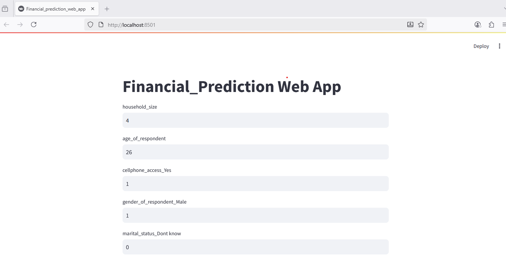

# 📊 Financial Prediction Web App

This is a **Streamlit-based web application** that predicts whether an individual has a bank account based on demographic and socioeconomic features. The app uses a pre-trained machine learning model (`financial_model_v2.pkl`) to make predictions.  

---

## 🚀 Features
- Simple and interactive **web interface** built with Streamlit  
- Collects user input such as:  
  - Household size  
  - Age of respondent  
  - Cellphone access  
  - Gender  
  - Marital status  
  - Education level  
- Predicts whether the person **has a bank account** or **does not have a bank account**  

---

## 📂 Project Structure

- ├── Financial_prediction_web_app.py # Streamlit app script
- ├── financial_model_v2.pkl # Trained ML model
- ├── requirements.txt # Python dependencies
- └── README.md # Project documentation
---

## ⚙️ Installation

1. **Clone this repository or download the project file** 

   - git clone https://github.com/VickkyV/Financial-Prediction-Web-App.git
   - cd financial-prediction-app

2. **Create a virtual environment (recommended)**

- python -m venv venv
- source venv/bin/activate   # On Linux/Mac
- venv\Scripts\activate      # On Windows

3. **Install dependencies**

- pip install -r requirements.txt

## ▶️ Usage
Run the app with Streamlit:

- streamlit run Financial_prediction_web_app.py
Then, open the link displayed in your terminal (default: http://localhost:8501/) to interact with the app in your browser.

## 🧑‍💻 Requirements
 - Python 3.8+
 - See requirements.txt for all dependencies

 ## 👨‍💻 Author

**Adeyemi Bisola (VickkyV)**  
- 💼 GitHub: [VickkyV](https://github.com/VickkyV)  
- 📧 Email: adeyemibisola92@gmail.com   
- 🌍 Passionate about Data Science, Machine Learning, and building impactful web applications.  
